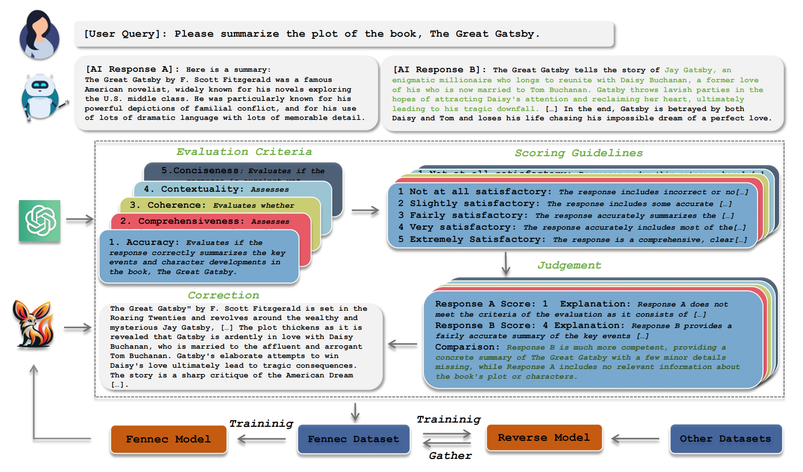

<p align="center">
  
</p>

<h1 align="center"> Fennec </h1>

**Fennec** is a tool designed for automating the evaluation of conversational data, offering judgements across multiple dimensions and granularities. 

**Fennec** aim is to address two key challenges:

+ *Multidimensional Evaluation*: providing comprehensive or accurate responses to multi-intent queries.
+ *Scaling Evaluation Capabilities*: extending evaluation abilities to encompass a wider array of scenarios and usage examples.

## 🎫 Approach
<div style="text-align:center;">
    
</div>

**Fennec** provides a step-by-step framework designed for evaluating conversational responses using a *Branching* mechanism.

1. *Evaluation Criteria*: Offers users multiple evaluation dimensions for their queries.
2. *Scoring Guidelines*: Extends scoring rules (1-5 points) for each scoring dimension.
3. *Judgements*: Scores based on evaluation criteria and scoring guidelines.
4. *Correction*: Addresses issues identified within the conversations accordingly.


## 🧱 Available Resource

| Model | Parameters | Datasets | Agreement ⬆ | Consistency ⬆ |
|:---:|:---:|:---:|:---:|:---:|
| GPT-4 | - | - | 62.28 | 86.28 |
| GPT-3.5 | - | - | 42.74 | 62.43 |
| Auto-J | 13B | Auto-J | 54.96 | 83.41 |
| Fennec | 7B | Fennec | 56.63 | 86.32 |
| Fennec | 7B | Fennec-bridging | 57.40 | 87.00 |

## 🧩 Setup

1. The current version has minimal third-party dependencies:

    ```bash
    pip install SQLAlchemy # Utilized for data caching.
    pip install scikit-learn # Employed for computing evaluation metrics.
    pip install loguru # logging functionalities.
    ```

2. **Fennec** utilizes [vLLM](https://github.com/vllm-project/vllm) to launch inference services, currently supporting version >= 0.2.1.

    ```bash
    pip install vllm
    ```

    or build from source:
    ```bash
    git clone https://github.com/vllm-project/vllm.git
    cd vllm
    pip install -e .
    ```

## 🎮 Usage

Using **Fennec** involves two steps:

1. Launching vLLM server for Fennec evaluation:

    ```bash
    python scripts/run_vllm_server.sh
    ```
    > + EVAL_PARALLEL: allows for inference on multiple GPU resources concurrently when available. 
    > + MODEl_NAME: the address where the downloaded model is stored.
2. Evaluating benchmark dataset (or custom dataset):
    ```bash
    python scripts/fennec_eval.sh
    ```
    > -a -p {number}: execute parallel inference and specify the {number}.

We provide more detailed [Recipes](Recipes.md) on how to use the current repo.

## ☕ More


